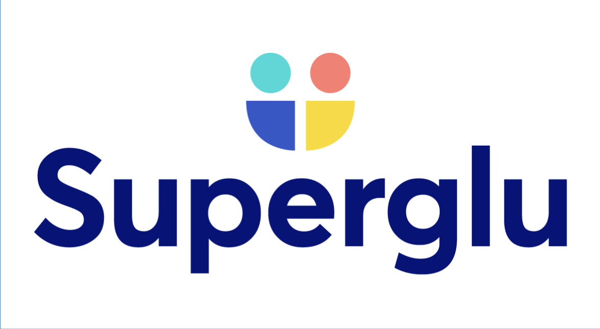

# SuperGlu

SuperGlu is an **AI-powered integration and automation platform** designed to help teams connect, sync, and manage data across multiple systems effortlessly. It allows businesses to streamline workflows, migrate data, and automate processes without writing complex custom code.  

SuperGlu leverages AI to intelligently map and transform data between APIs, databases, file sources, and legacy systems, making integrations faster, smarter, and more reliable.

## Key Features

- **Universal Integrations**: Connect any API, database, or file system without prebuilt connectors.  
- **AI-Assisted Workflows**: Describe workflows in natural language and SuperGlu generates automated integration logic.  
- **Self-Healing Logic**: Detects changes in connected systems and automatically adjusts workflows to prevent failures.  
- **Operational Syncs & Migrators**: Schedule data syncs and migrations with full monitoring and logging.  
- **Knowledge Capture**: Store and reuse business logic for team onboarding and consistent operations.  
- **Enterprise-Grade Security**: Secure credentials, access control, and compliance-ready deployments.

## Why Use SuperGlu?

- **Accelerate Development**: Reduce integration build time from months to minutes.  
- **Reduce Maintenance**: Automatic updates and self-healing logic keep workflows running smoothly.  
- **Save Engineering Time**: AI handles repetitive tasks, allowing teams to focus on higher-value work.

SuperGlu is perfect for businesses looking to simplify integration challenges, automate repetitive workflows, and modernize their data operations.

For more information, visit [SuperGlu Cloud](https://superglu.cloud).
